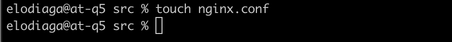
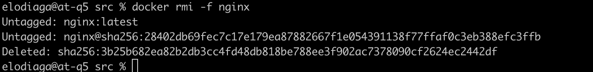
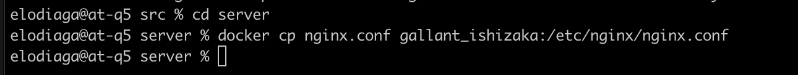
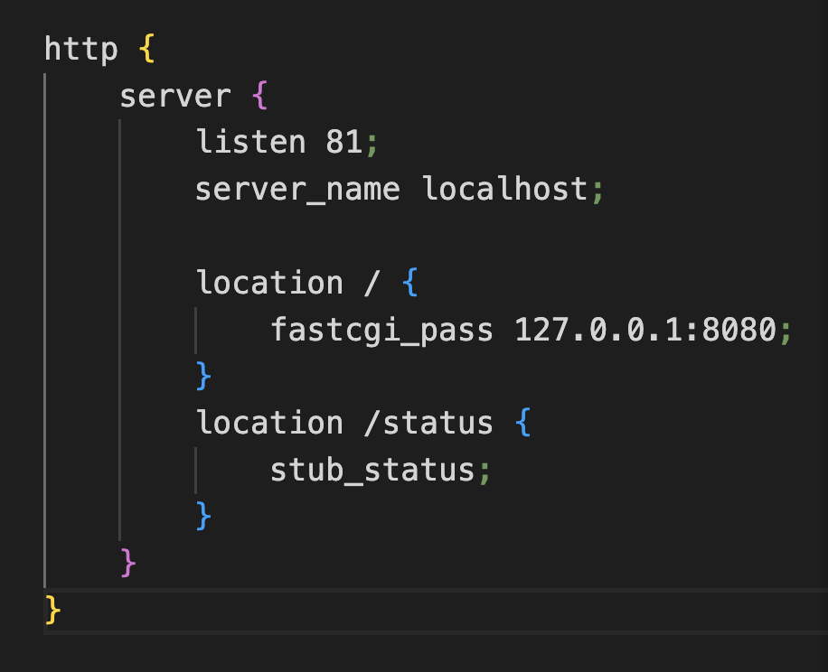

# Simple Docker

Введение в докер. Разработка простого докер-образа для собственного сервера.

## Part 1. Готовый докер

В качестве конечной цели своей небольшой практики ты сразу выбрал написание докер-образа для собственного веб-сервера, а потому в начале тебе нужно разобраться с уже готовым докер-образом для сервера.
Твой выбор пал на довольно простой **nginx**.

**== Задание ==**

##### Возьми официальный докер-образ с **nginx** и выкачай его при помощи `docker pull`.

##### Проверь наличие докер-образа через `docker images`.

##### Запусти докер-образ через `docker run -d [image_id|repository]`.
3. `запустим docker командой: docker run -d 3b25b682ea82`

 >-d: это флаг, указывающий на запуск контейнера в фоновом режиме (detached mode). Это означает, что контейнер будет работать в фоновом режиме, и командная строка будет освобождена для дальнейшего использования.

##### Проверь, что образ запустился через `docker ps`.
4. `посмотрим запущенные контейнеры`

> команда docker ps выводит только запущенные контейнеры. При запуске команды docker ps без дополнительных флагов будут отображены только запущенные контейнеры в текущий момент времени.
> ps -a выведет и остановленные контейнеры. 

##### Посмотри информацию о контейнере через `docker inspect [container_id|container_name]`.
5. `узнаем информацию о контейнере с помощью команды:`
>`docker inspect charming_jackson`

##### По выводу команды определи и помести в отчёт размер контейнера, список замапленных портов и ip контейнера.
6. `выведем размер контейнера:`
>`docker inspect charming_jackson --size | grep -i -e Size`

6.1. `выведем список замапленных портов:` 
  

  6.2. `выведем ip контейнер командой:`

  

##### Останови докер образ через `docker stop [container_id|container_name]`.

 ##### Проверь, что образ остановился через `docker ps`.

  `остановим контейне командой:`
>`docker stop charming_jackson`

 `проверим остановк командой:`
>`docker ps`

 ##### Запусти докер с портами 80 и 443 в контейнере, замапленными на такие же порты на локальной машине, через команду *run*.
7. `запустим докер через с порты 80 и 443 командой:`
>`docker run -d -p 80:80 -p 443:433 nginx`

где флаг -p - порт

-d    - daemon работа в фоновом режиме 

##### Проверь, что в браузере по адресу *localhost:80* доступна стартовая страница **nginx**.
8. `проверим в браузере по адресу localhost:80 доступ к стартовой странице nginx:`

##### Перезапусти докер контейнер через `docker restart [container_id|container_name]`.
9. `перезапусти командой docker restart charming_jackson и проверил запуск docker ps:`

##### Проверь любым способом, что контейнер запустился.
10. `посмотрим запущенные контейнер командой:` 
>`docker ps`

## Part 2. Операции с контейнером

##### Прочитай конфигурационный файл *nginx.conf* внутри докер контейнера через команду *exec*.
1. `прочитаем конфигурационный файл *nginx.conf командой:`
  >`docker exec ecstatic_shamir  cat /etc/nginx/nginx.conf `

##### Создай на локальной машине файл *nginx.conf*.
2. `создадим локальный файл nginx.conf командой:`
>`touch nginx.conf`

 

##### Настрой в нем по пути */status* отдачу страницы статуса сервера **nginx**.
3. `настроим по пути /status отдачу страницы статуса сервера`

##### Скопируй созданный файл *nginx.conf* внутрь докер-образа через команду `docker cp`.
4. `скопируем созданный файл внутрь докер-образа командой:`
>`docker cp nginx.conf ecstatic_shamir:/etc/nginx`

##### Перезапусти **nginx** внутри докер-образа через команду *exec*.
5. `Перезапустим ngin командой:` 
>`docker exec ecstatic_shamir nginx - s reload`

##### Проверь, что по адресу *localhost:80/status* отдается страничка со статусом сервера **nginx**.
6. `проверим адрес localhost:80/status командой:`
>`docker exec ecstatic_shamir curl localhost:80/status`

.png)

.png)

##### Экспортируй контейнер в файл *container.tar* через команду *export*.
##### Останови контейнер.
7. `экспортируем в файл, остановим контенер и проверим остановку командами:`
>`docker export ecstatic_shamir > container.tar`

8. >`docker stop ecstatic_shamir`
>`docker ps`

##### Удали образ через `docker rmi [image_id|repository]`, не удаляя перед этим контейнеры.
9. `удалим образ командой:` 
>`docker rmi -f nginx`

-f - опция "force", которая принудительно удаляет образ, даже если он используется запущенными контейнерами

##### Удали остановленный контейнер.
10. `удалим остановленный контейнер командой:`
>`docker rm ecstatic_shamir`

##### Импортируй контейнер обратно через команду *import*.
11. `импортируем контейнер обратно командой:`
>`docker import -c 'CMD ["nginx", "-g", "daemon off;"]' -c 'ENTRYPOINT ["/docker-entrypoint.sh"]' container.tar nginx`

опция -c используется для задания команды запуска образа при его выполнении. В данном случае, задана команда CMD ["nginx", "-g", "daemon off;"], которая запустит контейнер с использованием Nginx и опцией -g для указания глобальных директив Nginx. Фраза daemon off; отключает режим демона Nginx, позволяя процессу остаться в переднем плане, а не перейти в фоновый режим.

-c 'ENTRYPOINT ["/docker-entrypoint.sh"]': опция -c также используется для задания точки входа (entrypoint) образа.

##### Запусти импортированный контейнер.
12. запустим импортированный контейнер командой:
>`docker run -d -p 80:80 -p 443:433 f12c9511cf4b3c5606f7e4943e25d0741118a976bc7a5a30a9bf3bd7ae87b4bb`

##### Проверь, что по адресу *localhost:80/status* отдается страничка со статусом сервера **nginx**.
13. проверим отдачу страницы со статусом сервера nginx

## Part 3. Мини веб-сервер

Теперь стоит немного оторваться от докера, чтобы подготовиться к последнему этапу. Время написать свой сервер.

**== Задание ==**

##### Напиши мини-сервер на **C** и **FastCgi**, который будет возвращать простейшую страничку с надписью `Hello World!`.
1. `написал мини сервер на языке Си и FastCGI`

`функция FCGI_Accept() принимает FastCGI-запрос и возвращает значение, указывающее успешность его выполнения. При успешном выполнении запроса выполняется блок кода внутри цикла.`

`внутри цикла выводится HTTP-заголовок, указывающий, что содержимое является текстом HTML (Content-type: text/html) и статус ответа (Status: 200 OK). Затем выводится сам контент ответа (Hello World!).`

##### Запусти написанный мини-сервер через *spawn-fcgi* на порту 8080.

2. запустим контейнер с образом Nginx и привязал порт 81 на хостовой машине к порту 81 внутри контейнера командой:
>`docker run -d -p 81:81 nginx`. 

>-d - опция "detach", которая запускает контейнер в фоновом режиме
>-p 81:81 - опция "publish", которая привязывает порт 81 на хостовой машине к порту 81 в контейнере apt

- далее скопируем созданный файл nginx.conf и мини-сервер в докер контейнер командой:
>`docker cp nginx.conf gallant_ishizaka:/etc/nginx/`
>`docker cp server_prt_3.c gallant_ishizaka:/home` 

- зайдём в его терминал: 
  >`docker exec -it gallant_ishizaka bash`

- установим необходимое ПО командами: 

> `apt-get update` 

> `apt-get install -y gcc spawn-fcgi libfcgi-dev`

spawn-fcgi - пакет, содержащий инструмент для запуска FastCGI-программ

libfcgi-dev - пакет, содержащий заголовочные файлы и библиотеку FastCGI для разработки

-y - c данной опцией на все вопросы автоматически предоставляется ответ Yes. Это полезно при автоматической установке пакетов в скриптах или в среде контейнеров, где интерактивное взаимодействие с пользователем невозможно.

spawn-fcgi используется для запуска удаленных и локальных FastCGI процессов.

- скомпилируем, запустим мини-сервер через spawn-fcgi на порту 8080 и перезагрузим nginx командами:

>`gcc -o server part3.c -lfcgi`

>`spawn-fcgi -p 8080 ./server`

>`nginx -s reload`

-lfcgi - опция "link", указывает, что программа должна быть связана с библиотекой libfcgi

##### Напиши свой *nginx.conf*, который будет проксировать все запросы с 81 порта на *127.0.0.1:8080*.
3. напишем свой nginx.conf

##### Проверь, что в браузере по *localhost:81* отдается написанная тобой страничка.
4. перейдём в браузере по адрессу localhost:81

##### Положи файл *nginx.conf* по пути *./nginx/nginx.conf* (это понадобится позже).
5. скопируем конфигурационный файл nginx в наш контейнер, командой:
> `docker cp nginx.conf gallant_ishizaka:/etc/nginx/nginx.conf`      

## Part 4. Свой докер

Теперь всё готово. Можно приступать к написанию докер-образа для созданного сервера.

**== Задание ==**

*При написании докер-образа избегай множественных вызовов команд RUN*

#### Напиши свой докер-образ, который:
##### 1) собирает исходники мини сервера на FastCgi из [Части 3](#part-3-мини-веб-сервер);

##### 2) запускает его на 8080 порту;
##### 3) копирует внутрь образа написанный *./nginx/nginx.conf*;
##### 4) запускает **nginx**.
_**nginx** можно установить внутрь докера самостоятельно, а можно воспользоваться готовым образом с **nginx**'ом, как базовым.
1. создадим файл с названием Dockerfile в папке src/part4 и напишем в нём докер образ 

> FROM задает образ, чья файловая система берется за основу.

> WORKDIR задает рабочий каталог, относительно которого выполняются все действия во время формирования образа и при входе в контейнер.

> ADD добавляет файлы/папки из текущего окружения в образ. Если в качестве копируемого файла указать архив, то он будет добавлен в образ в распакованном виде. Также в качестве источника принимает URL.

> COPY копирует файлы и директории с хост-машины внутрь Docker-образа.

> RUN выполняет переданную строчку в терминале от пользователя root. С ее помощью вносятся основные изменения в файловую систему, добавляются пакеты, ставятся зависимости и так далее.

> CMD задает команду, которая выполняется при запуске контейнера по умолчанию. Она используется только в том случае, если контейнер был запущен без указания команды. Используется CMD
docker run -it hexlet/docker-fastify-example # npm start

> CMD не используется, так как явно указан bash
docker run -it hexlet/docker-fastify-example bash

> ENTRYPOINT указывает команду, которой будет передаваться параметр при запуске контейнера.

> EXPOSE Указывает, какой порт должно использовать приложение внутри контейнера.

> /bin/bash запускает интерактивный режим командной оболочки Bash. 

##### Собери написанный докер-образ через `docker build` при этом указав имя и тег.
2. `соберём докер образ командой:`
> `docker build . -t docker_elodiaga:1.0`

##### Проверь через `docker images`, что все собралось корректно.
3. `проверим сборку командой:`
>`docker images`

##### Запусти собранный докер-образ с маппингом 81 порта на 80 на локальной машине и маппингом папки *./nginx* внутрь контейнера по адресу, где лежат конфигурационные файлы **nginx**'а (см. [Часть 2](#part-2-операции-с-контейнером)).
4. `запустим собранный докер-образ с маппингом 81 порта на 80 на локальной машине и маппингом папки командой:`
>`docker run -d -p 80:81 -v /Users/elodiaga/DO5_SimpleDocker-1/src/part4/nginx.conf:/etc/nginx/nginx.conf docker_elodiaga:1.0 bash`

> -p 80:81 - маппинг портов. Порт 80 на локальной машине будет проксироваться на порт 81 внутри контейнера.

> -v в команде Docker используется для создания маппинга томов (volumes). Он позволяет связывать директории или файлы на вашем хосте с директориями внутри контейнера.

> -d: Запускает контейнер в фоновом режиме (daemon mode).

##### Проверь, что по localhost:80 доступна страничка написанного мини сервера.
5. убедимся в доступности странички мини сервера по адресу localhost:80 командой:

>`curl localhost:80`

##### Допиши в *./nginx/nginx.conf* проксирование странички */status*, по которой надо отдавать статус сервера **nginx**.
6. `допишем проксирование странички:`
 

##### Перезапусти докер-образ.
*Если всё сделано верно, то, после сохранения файла и перезапуска контейнера, конфигурационный файл внутри докер-образа должен обновиться самостоятельно без лишних действий*
7. `перезагрузим наш контейнер командой:`
> `docker restart hungry_jang `   

##### Проверь, что теперь по *localhost:80/status* отдается страничка со статусом **nginx**
8. теперь по *localhost:80/status* отдается страничка со статусом **nginx*

## Part 5. **Dockle**

##### Просканируй образ из предыдущего задания через `dockle [image_id|repository]`.
##### Исправь образ так, чтобы при проверке через **dockle** не было ошибок и предупреждений.

- установим утилиту dockly командой:
>`brew install goodwithtech/r/dockle`

1. скопируем папку с 4го задания

2. соберём образ командой: 
>`docker build . -t docker_elodiaga:2.0 ` 

3. просканируем образ test_jhadxaro:2.0 на ошибки командой:
>`dockle docker_elodiaga:2.0`

4. для исправления ошибок отредактируем Dokerfile 

5. соберём образ и запустим проверку командами:
>`docker build . -t docker_elodiaga:2.0`

>`dockle -ak NGINX_GPGKEY -ak NGINX_GPGKEY_PATH docker_elodiaga:2.0`

## Part 6. Базовый **Docker Compose**

##### Напиши файл *docker-compose.yml*, с помощью которого:
##### 1) Подними докер-контейнер из [Части 5](#part-5-инструмент-dockle) _(он должен работать в локальной сети, т.е. не нужно использовать инструкцию **EXPOSE** и мапить порты на локальную машину)_.
##### 2) Подними докер-контейнер с **nginx**, который будет проксировать все запросы с 8080 порта на 81 порт первого контейнера.
1. поднимем докер-контейнер с nginx

##### Замапь 8080 порт второго контейнера на 80 порт локальной машины.
2. замапим 8080 порт второго контейнера на 80 порт локальной машины.

##### Останови все запущенные контейнеры.
3. остановим все запущенные контейнеры командой:
> `docker stop dazzling_banzai`

##### Собери и запусти проект с помощью команд `docker-compose build` и `docker-compose up`.
4. соберём и запустим проект с помощью команд:
> `docker-compose build` 
> `docker-compose up -d`

> флаг -d означает "в фоновом режиме" (detached mode), что позволяет вам запустить контейнеры в фоне, без блокировки вашего терминала.

> chown -R nginx:nginx /etc/nginx/nginx.conf; Эта команда изменяет владельца и группу файла конфигурации Nginx на nginx, чтобы пользователь nginx имел право на его чтение и запись.

##### Проверь, что в браузере по *localhost:80* отдается написанная тобой страничка, как и ранее.

